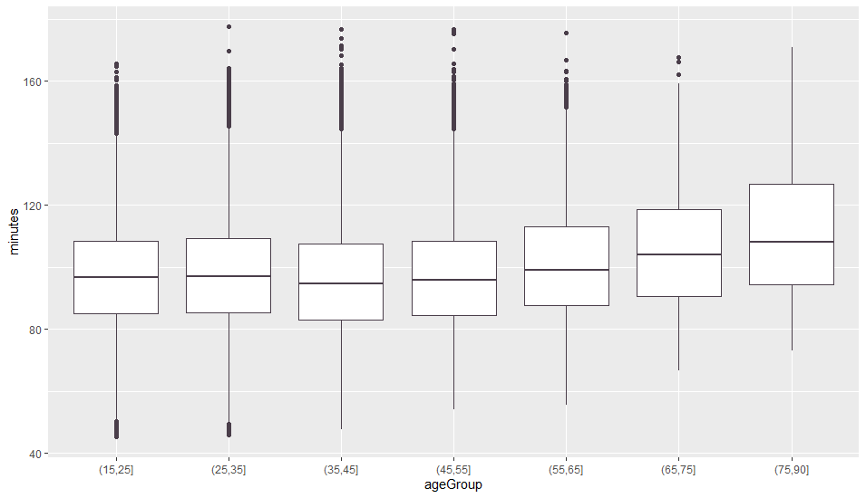

## Introduction
With the massive explosion of data generated and published in the past few decades comes new challenges. Data analysts and scientists now have to discover patterns in this unprecedented amount of raw and often redundant data. In order to do that, data must go through a very critical and sensitive process of cleaning to produce high quality data that can later be used to estimate and draw generalizable conclusions. 

In this report datasets provided by Credit Union Cherry Blossom Ten Mile Run were used. Cherry Blossom started in 1973 with the primary objective of  training elite runners who were aiming to participate in the Boston Marathon. Since then, it has gained more popularity. In 2012 nearly 17,000 runners ranging in age from 9 to 89 participated. The organizers publish the results after each year’s race at http://www.cherryblossom.org/. The datasets include the runners' names, ages, and hometowns which act as a valuable resource for forming a better understanding of the relationship between age and performance. 


## Loading the data

13 text files for each gender containing data from 1999 to 2012 was rearranged in one excel sheet with 150000 observations. This process would be very tedious and time consuming if done manually considering how both the format and the manner the information was reported is different from year to year. These changes can be seen as differences in the format of the table header and the use of footnotes. The tables had many errors including values that begin in the wrong column, missing headers, as well as other mistakes


Fig 1 here


a customized programming approach was used to transform the text files to tables using R language, the following codes shows the two main functions for finding the columns locations and seperating the rows to each columns

```{r} 


findLocs = function(spaceRow) {
  
  rowLength = nchar(spaceRow)
  searchLocs <- c(0,gregexpr(" ",spaceRow)[[1]])
  if (substring(spaceRow, rowLength, rowLength) != " ")
   return(c(searchLocs,rowLength +1))
  else return(searchLocs)
    
}
```

```{r}

MakeColumns <- function(rowData,year){
  
  indexEq <-grep('^==',rowData)
  headerRow <- rowData[indexEq-1]
  body <- rowData[indexEq+1:length(rowData)]
  spaceRow <- rowData[indexEq]
  headerRow <- tolower(headerRow)
  searchLocs <- findLocs(spaceRow)
  df <- mapply(substr,list(body),start=searchLocs[-length(searchLocs)]+1,
        stop = searchLocs[-1]-1)
  colnames(df)<-mapply(substr,list(headerRow),start=searchLocs[-length(searchLocs)]+1,
                       stop = searchLocs[-1]-1)
  
  df <- select(df,c('place','ag','name','hometown','time'))
  return(df)
}

```

---

## Inspecting/Cleaning The Data
jjkjkjk


we have successfully loaded all the data into one table

we have selected the following columns 


```{css,echo=FALSE}
table{
  text-transform: capitalize;
}


```
  by first inspection  we see the age values for 2003 and 2006 does look off, a box plot can be a great tool to detect errors like this, going back to the original text files, 
  and fixing our initial loading programs, we fixed it
  
  
  

```{r echo=FALSE,message=FALSE}
Df <- read.csv('Blossom.csv')

Df2<-read.csv('Blossom2.csv')

knitr::kable(head(Df), caption = "An example table caption.")
```


In order to be able to manipulate the time, a new formate should be made
from h:m:s to number of minutes

This can easily be made with a function like this

```{r}
toMinutes <- function(x){
  
  
  if(length(x)==2){
    return(x[1]+x[2]/60)}
  else{return(x[1]*60 + x[2] +x[3]/60)
  }
}
```


A summary of the amount of minutes across both genders and all years, no outliers and 505 missing data out of 15000


```{r, echo=FALSE}


summary(Df2$minutes)
```

next we are ready to explore the data more 


---


## Exploring the data

plotting scatter plot


A better way is to divide the ages to age group and plot summary data(ex box plot)



. This sequence
of boxplots shows the quartiles of time for men grouped into 10-year age intervals. As age
increases, all the quartiles increase. However, the box becomes asymmetrical with age, which
indicates that the upper quartile increases faster than the median and lower quartile


Differences between Males And Females


```{r,echo=FALSE, message=FALSE}
library(tidyverse)
library(kableExtra)

diff <- read.csv('difference.csv')
colnames(diff)<-c('15-25', '25-35', '35-45','45-55','55-65','65-75','75-90')
knitr::kable(head(diff), caption = "difference between males and females") %>% kable_styling(position = "center")


```


